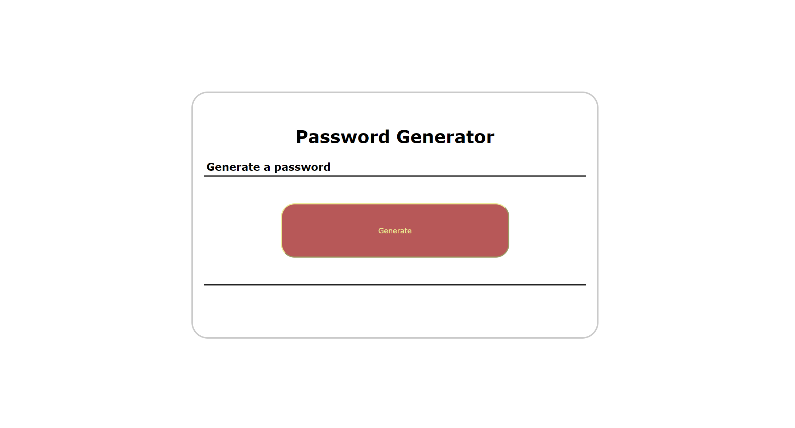

# Password-Generator

## Description
- What was your motivation?
My motivation for this project was to build a simple password generator that would allow a user to generate a secure password based on their character (numbers, letters, special) preferences.

- Why did you build this project? 
^

- What problem does it solve?
^

- What did you learn?
I learnt more about generating random numbers using javascript, and implementing randomisation functions in general.

## Installation

Navigate to github repo at https://github.com/J-D-garwood/03-Password-Generator. Download all files (index.html, assets folder w/ css and images)

## Credits

No collaborators on this project

## License

N/a

## link to deploayed application
https://j-d-garwood.github.io/03-Password-Generator/

## Image of deployed application

